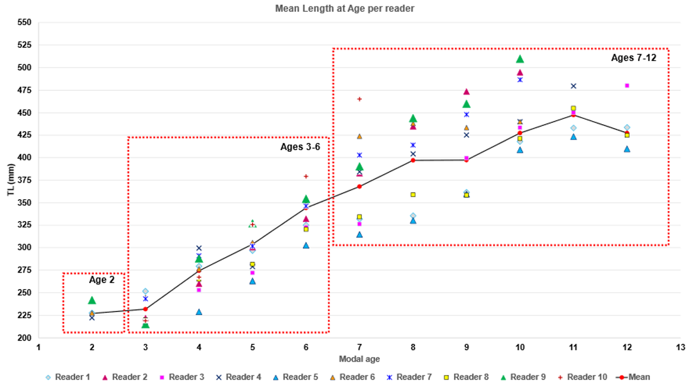

\newpage
```{r setup, include=FALSE}
knitr::opts_chunk$set(echo = TRUE)
```
\newpage
# Introduction
Since the WKMEGRIM benchmark in 2022 [@ICES2023], the assessment of Megrim in divisions 7.b-k, 8.a, 8.b, and 8.d has been conducted using an a4a model [@MillarJardim2019]. While this model initially delivered acceptable results, the 2024 assessment began to show signs of concern, and by 2025, significant issues had already emerged  - particularly in the retrospective pattern, which was deemed unacceptable by ACOM.

Consequently, in 2025 review level benchmark was conducted. The objective of the review-level benchmark was to diagnose the root causes of the retrospective bias and implement corrections to the data and/or model configuration to enhance the accuracy and reliability of the assessment.

Key Corrections:
-	Catch Data: Catch-at-age and weight data did not align with total reported catches. Adjustments were made to ensure consistency.
-	IRLFR Index: Included age classes outside the defined stock area. The index was re-estimated to exclude these individuals.
-	Porcupine Index: The plus group was incorrectly set at age 8. It was corrected to age 10 to match the appropriate age structure.

Model Modifications (a4a Sub-models):
-	Fishing Selectivity: A shift in weight-at-age around 2014 indicated a change in fishing patterns. Two time blocks were introduced-pre-2014 and post-2014-to reflect this.
-	Age-Class Inconsistencies: Surveys from 2015-2019 showed high numbers of young fish that did not appear in later catches or surveys. To improve model fit, data for ages 1-3 from 2015-2021 were removed.
-	Spline Function Knots: The impact of knot settings in spline functions was evaluated and updated to enhance model performance.

A comprehensive account of the assessment review conducted during the 2025 review-level benchmark is provided in Working Document WD12 [@ICES2025]. Additionally, a detailed analysis of the reference points, calculated in accordance with the revised assessment framework, is available in Working Document WD13 [@ICES2025]. 

While these adjustments improved the overall model fit, they did not fully eliminate the retrospective bias. Further investigation is required to resolve remaining uncertainties.

This document starts presenting the results from the assessment model used in last year's advice, updated with 2025 data. From there, proposed corrections and modifications are introduced progressively, each under its own dedicated section (e.g., catch data correction, index data re-estimated, selectivity adjustments, etc.). At every step, the impact of each change is evaluated using a  set of diagnostic plots: the retrospective analysis, selectivity and catchability of indices, residuals, and observed versus predicted catches. This approach allows for a transparent and systematic assessment of how each modification influences model performance.

```{r}
#| echo: false
#| results: "hide"
#| message: false
#| warning: false

library(a4adiags)
library(gridExtra)
library(grid)
library(lattice)
library(RColorBrewer)
library(dplyr)
library(FLCore)
library(icesAdvice)
library(reshape2)
library(ggplot2)
library(readxl)
library(tidyverse)
library(tibble)
library(icesDatras)
library(proxy)
library(stringr)

set.seed(1234)
```

# Base case model

```{r}
#| echo: false
#| results: "hide"
#| message: false
#| warning: false

# load index and stock data
load("Input/bootstrap/data/stock/meg78_stock_sop_corrected.RData")
load("Input/bootstrap/data/indices/meg78_indices.RData")

# The following changes were defined in the 2022 Benchmark of Megrim (ICES, 2023).
index<- tun.sel[c("SP_PORC","CPUE.IRLFRsurvey")]
index_org_org <- index
# The following changes were defined in the 2025 review level Benchmark of Megrim (ICES, 2025).
index[[2]]@index[ac(1:3),ac(2015:2021)] <- NA # IRLFR
index[[1]]@index[ac(1:3),ac(2015:2021)] <- NA # Porcupine

index_org <- index
index_org[[2]]@index['1','2011'] <- NA # strange outlier, set to NA in IRLFRsurvey 2011

stock@catch.n['1',as.character(1984:2000)] <- NA # We do not really believe that the increase in 1-year-olds in the catch is real so we shouldn't formulate a model that treats it as real.

```

## Model configuration

The a4a model is defined by sub-model which require the definition of their mathematical structure. There are five sub-models in operation:

```{r, message=FALSE, warning=FALSE}
fmod <- ~s(ifelse(year <= 2013 & age > 7, 7, 
                  ifelse(year >= 2014 & age > 6, 6, age)), k = 3, by = breakpts(year, 2013)) + factor(year)
srmod <- ~ factor(year) 
qmod <- list(~ I(1 / (1 + exp(-age))),~ I(1 / (1 + exp(-age))))
n1mod <- ~s(age, k = 3)
vmod <- list(~s(age, k = 3), ~1, ~1)
```

The fishing mortality-at-age model (fmodel) estimates selectivity-at-age using two different time blocks: one covering the historical period until 2013, and an-other from 2014 onwards. The shape of the F-at-age pattern is independently estimated for each age except ages 7 and older in the first period and except ag-es 6 and older in the second period, which are assumed to have the same F. This F pattern is then scaled up and down independently for each year. 

Stock-recruitment model (srmodel) estimates independent recruitments for each year without any functional form (no stock-recruitment relationship).

Catchability models (qmodel) for both surveys [SpPGFS-WIBTS-Q4 (G5768) and the combined FR_IE_IBTS (G9527_G7212)] assumes a logistic model.

The population in the first year of the time-series model (n1model) uses the default value of a4aSCA function that estimates abundances independently for each age.

The model that controls the shape of the observation variances (vmodel) is also the default in a4aSCA function, a smooth function for the catch numbers-at-age and 'flat' for the indices.

```{r}
#| echo: false
#| results: "hide"
#| message: false
#| warning: false
fit0 <- sca(stock, index_org, fmodel = fmod, qmodel = qmod, srmodel = srmod, vmod = vmod, n1mod = n1mod)
stk0 <- stock + fit0
```

## Retrospective analysis plot

@fig-retro_wgbie presents the retrospective analysis of the 2025 assessment for Megrim, illustrating trends in recruitment, SSB, and fishing mortality (F). The corresponding Mohn's rho values, shown in @fig-retro_wgbie, quantify the retrospective bias in terminal year estimates. 

Mohn's rho values are  considered acceptable by ICES when they fall within the range of -0.15 to 0.20; however, the observed values were a bit outside this threshold, indicating retrospective bias.

```{r}
#| echo: false
#| label: fig-retro_wgbie
#| fig-cap: "Retrospective analysis in the 2026 assessment, showing time series and Mohn's rho values for median catch, fishing mortality (F, ages 3-6), recruitment (age 1), and spawning stock biomass (SSB)."
#| message: false
#| warning: false

source('./docs/retro_analysis_f.R') # retrospective function

results <- run_retro_analysis(stock, index_org, fit0, fmod, qmod, srmod, vmod, n1mod)

results$rho_table <- results$rho_table %>% mutate(x = 2025, y = 0)

results$rho_table$qname <- c("F" = "F", "SSB" = "SSB", "Recruitment" = "Rec", "Catch" = "Catch")

new_names <- c("Rec" = "Recruitment", "SSB" = "SSB", "Catch" = "Catch", "F" = "F")
plot(FLStocks(results$retro), col = 1, lwd = 1) +
  facet_wrap(~qname, scales = 'free_y', labeller = labeller(qname = new_names)) +
  geom_text(
    data = results$rho_table,
    aes(x = x, y = y, label = label),
    inherit.aes = FALSE,
    hjust = 1, vjust = 0) +
  theme_bw() +
  labs(color = "N years removed")
```

## Selectivity and catchability plot

The fishery selectivity and  catchabilities of the indices are shown in @fig-fc_wgbie.

```{r}
#| echo: false
#| label: fig-fc_wgbie
#| fig-cap: "Fishery selectivity and indices catchabilities estimates in the 2026 assessment."
#| message: false
#| warning: false

fitted <- predict(pars(fit0))
a  <- xyplot(data~age,groups=year,stk0@harvest,type='b',ylim=c(0,1),ylab='F',main='Fishing mortality')
a1 <- xyplot(data~age,groups=year,data=fitted$qmodel[1],type='b',ylab='Catchability',main="Porcupine")
a2 <- xyplot(data~age,groups=year,data=fitted$qmodel[2],type='b',ylab='Catchability',main="IRLFR")
grid.arrange(a,a1,a2,ncol=2)
```

## Residuals plot

The catch-at-age and index-at-age residuals are shown in @fig-res_wgbie.

```{r}
#| echo: false
#| label: fig-res_wgbie
#| fig-cap: "The catch-at-age and index-at-age (Porcupine and IRLFR) residuals in the 2026 assessment."
#| message: false
#| warning: false
res0 <- residuals(fit0, stock, index_org)
plot(res0)
```

## Observed and predicted catches plot

The differences among observed and predicted catches are shown in (@fig-POcatch_wgbie).

```{r}
#| echo: false
#| label: fig-POcatch_wgbie
#| fig-cap: "Comparison of observed and predicted catch in the 2026 assessment."
#| message: false
#| warning: false

df <- tibble(
  Year = as.numeric(dimnames(catch(stock))$year),  
  Observed = as.numeric(catch(stock)),
  Predicted = as.numeric(catch(stk0))
) %>%
  pivot_longer(cols = c(Observed, Predicted), names_to = "Type", values_to = "Catch")

ggplot(df, aes(x = Year, y = Catch, color = Type)) +
  geom_line(size = 1.2) +
  labs(x = "Year",
       y = "Catch (tonnes)",
       color = "Catch type") +
  theme_bw()
```

# Data corrections
## Historically, there was a strange outlier in IRLFR for recruitment (age-1) in 2011

For IRLFR index, the 2011 value was set to NA following the revisions adopted in the 2022 Megrim Benchmark [@ICES2023]. However, due to the last update of the index in WGBIE2025, there is not a strange outlier in 2011, and the value of 2011 is similar to the one observed in 2009 and 2010 (@fig-rec_irlfr).

```{r}
#| echo: false
#| label: fig-rec_irlfr
#| fig-cap: "Age-1 IRLFR index."
#| message: false
#| warning: false

old <- read.csv("Input/IGFS_EVHOE_index/2024WGBIE_IRLFindex.csv", sep=";") %>%
  select(Year, X1) %>%
  mutate(value = X1,
         source = "Old")

y <- as.numeric(tun.sel[["CPUE.IRLFRsurvey"]]@index[1, ])
x <- as.numeric(colnames(tun.sel[["CPUE.IRLFRsurvey"]]@index))

new <- data.frame(
  Year = x,
  value = y,
  source = "New"
) %>%
  filter(Year < 2024)

df <- bind_rows(old, new)

ggplot(df, aes(x = Year, y = value, color = source)) +
  geom_point(size = 4) +
  geom_line(size = 2) +
  ggtitle("CPUE.IRLFRsurvey") +
  ylab("numbers per 10 hours fished") +
  xlab("Year") +
  theme_minimal() +
  scale_color_manual(values = c("Old" = "steelblue", "New" = "darkorange"))
```

I propose no removing 2011 values.

```{r}
#| echo: false
#| results: "hide"
#| message: false
#| warning: false

fit1 <- sca(stock, index, fmodel = fmod, qmodel = qmod, srmodel = srmod, vmod = vmod, n1mod = n1mod)
stk1 <- stock + fit1
```

### Retrospective analysis plot

```{r}
#| echo: false
#| label: fig-retro_utliersNA
#| fig-cap: "Retrospective analysis showing time series and Mohn's rho values for median catch, fishing mortality (F, ages 3-6), recruitment (age 1), and spawning stock biomass (SSB), after correcting the no outliers in the IRLFR index data."
#| message: false
#| warning: false

results <- run_retro_analysis(stock, index, fit1, fmod, qmod, srmod, vmod, n1mod)

results$rho_table <- results$rho_table %>% mutate(x = 2025, y = 0)
results$rho_table$qname <- c("F" = "F", "SSB" = "SSB", "Recruitment" = "Rec", "Catch" = "Catch")
       
new_names <- c("Rec" = "Recruitment", "SSB" = "SSB", "Catch" = "Catch", "F" = "F")
plot(FLStocks(results$retro), col = 1, lwd = 1) +
  facet_wrap(~qname, scales = 'free_y', labeller = labeller(qname = new_names)) +
  geom_text(
    data = results$rho_table,
    aes(x = x, y = y, label = label),
    inherit.aes = FALSE,
    hjust = 1, vjust = 0) +
  theme_bw() +
  labs(color = "N years removed")
```
### Selectivity and catchability plot
```{r}
#| echo: false
#| label: fig-fc_utliersNA
#| fig-cap: "Fishery selectivity and indices catchabilities estimates from the assessment, after correcting the no outliers in the IRLFR index data."
#| message: false
#| warning: false

fitted <- predict(pars(fit1))
a  <- xyplot(data~age,groups=year,stk1@harvest,type='b',ylim=c(0,1),ylab='F',main='Fishing mortality')
a1 <- xyplot(data~age,groups=year,data=fitted$qmodel[1],type='b',ylab='Catchability',main="Porcupine")
a2 <- xyplot(data~age,groups=year,data=fitted$qmodel[2],type='b',ylab='Catchability',main="IRLFR")
grid.arrange(a,a1,a2,ncol=2)
```
### Residuals plot
```{r}
#| echo: false
#| label: fig-res_utliersNA
#| fig-cap: "The catch-at-age and index-at-age (Porcupine and IRLFR) residuals in the assessment, after correcting the no outliers in the IRLFR index data."
#| message: false
#| warning: false
res1 <- residuals(fit1, stock, index)
plot(res1)
```
### Observed and predicted catches plot
```{r}
#| echo: false
#| label: fig-POcatch_utliersNA
#| fig-cap: "Comparison of observed and predicted catch in the assessment, after correcting the no outliers in the IRLFR index data."
#| message: false
#| warning: false

df <- tibble(
  Year = as.numeric(dimnames(catch(stock))$year),  
  Observed = as.numeric(catch(stock)),
  Predicted = as.numeric(catch(stk1))
) %>%
  pivot_longer(cols = c(Observed, Predicted), names_to = "Type", values_to = "Catch")

ggplot(df, aes(x = Year, y = Catch, color = Type)) +
  geom_line(size = 1.2) +
  labs(x = "Year",
       y = "Catch (tonnes)",
       color = "Catch type") +
  theme_bw()
```

## Error in Belgium 2022 Landings: Landings and Discards were summed

The number of individuals used in the assessment as landings for Belgium in 2022 was incorrect, as it actually corresponded to the sum of landings and discards (@fig-BE_2022_error_assess).

```{r, message=FALSE, warning=FALSE, echo =FALSE}

LD_age_cntry <- read_excel("Input/Ctry_info/LD_age_cntry_BE_error.xlsx") # Used in the assessment CATON per country

# data at fleet and country level
data2022 <- read_excel("Input/Ctry_info/CatchAndSampleDataTables_mixfish2022.xlsx") # comes from intercatch
data2023 <- read_excel("Input/Ctry_info/CatchAndSampleDataTables_mixfish2023.xlsx") # comes from intercatch
data2024 <- read_excel("Input/Ctry_info/CatchAndSampleDataTables_mixfish2024.xlsx") # comes from intercatch
data2025 <- read_excel("Input/Ctry_info/CatchAndSampleDataTables_mixfish2025.xlsx") # comes from intercatch

data2022 <- data2022 %>% mutate(CatchCategory = case_when(
  CatchCategory %in% c("BMS landing", "Landings") ~ "Landings",
  TRUE ~ CatchCategory
))

data2223 <- rbind(data2022, data2023)
data22234 <- rbind(data2223, data2024)
data.flt <- rbind(data22234, data2025)

data.flt <- data.flt %>% select(Stock, Country, Year, CatchCategory, CATONRaisedOrImported, Area, Season, Fleet, Age, CANUM) 

data.flt <- data.flt %>%
  filter(CatchCategory %in% c("Landings", "Discards")) %>%
  group_by(Stock, Country, Year, CatchCategory, CATONRaisedOrImported, Area, Season, Fleet, Age) %>% 
  summarise(CANUM = sum(CANUM))

# Hay diferencies en los nind usado totales (excel) y el nind que da por flota (intercatch directo) ----
LD_age_cntry.org <- LD_age_cntry %>% filter (param== "nind") %>%
  pivot_longer(cols = `1`:`10`, names_to = "Age", values_to = "nind_assessment") %>%
  mutate(
    Age = as.numeric(Age),
    CatchCategory = catch.cat,
    Year = year,
    Country = country
  ) %>% mutate(
    CatchCategory = case_when(
      CatchCategory == "discards" ~ "Discards",
      CatchCategory == "landings" ~ "Landings",
      TRUE ~ CatchCategory 
    )) %>%
  mutate(Country = case_when(
    Country == "BE" ~ "Belgium",
    Country == "FR" ~ "France",
    Country == "IR" ~ "Ireland",
    Country == "SP" ~ "Spain",
    Country == "UK" ~ "UK (England)",
    TRUE ~ Country
  )) %>%
  mutate(nind_assessment = if_else(CatchCategory %in% c("Discards") & Age >= 9, 0, nind_assessment)) %>%
  select(Year, Country, CatchCategory, Age, nind_assessment)

# same for the three UK areas
uk_england <- LD_age_cntry.org %>% filter(Country == "UK (England)")
uk_northern_ireland <- uk_england %>% mutate(Country = "UK(Northern Ireland)")
uk_scotland <- uk_england %>% mutate(Country = "UK(Scotland)")

# Combine all
LD_age_cntry.org <- bind_rows(LD_age_cntry.org, uk_northern_ireland, uk_scotland)

# data at fleet level
data.flt.df <- data.flt %>%
  filter(Age > 0)  %>%
  mutate(CANUM = if_else(CatchCategory %in% c("Discards") & Age >= 9, 0, CANUM)) %>%
  group_by(Stock, Country, Year, CatchCategory, CATONRaisedOrImported, Area, Season, Fleet) %>%
  mutate(
    sum_over_10 = sum(CANUM[CatchCategory == "Landings" & Age > 10]),
    CANUM = if_else(CatchCategory == "Landings" & Age == 10, CANUM + sum_over_10, CANUM)
  ) %>%
  ungroup() %>%
  filter(Age <= 10) %>%
  group_by(Year, Country, CatchCategory, Age) %>% 
  summarise(CANUM = sum(CANUM)/1000)

data.flt.df2 <- data.flt.df %>%
  mutate(Country = case_when(
    Country %in% c("UK (England)", "UK(Northern Ireland)", "UK(Scotland)" ) ~ "UK",
    TRUE ~ Country
  )) %>%
  group_by(Year, Country, CatchCategory, Age) %>%
  summarise(CANUM = sum(CANUM, na.rm = TRUE), .groups = "drop")

# Paso 2: Unir con data.flt.df por Year, Country, CatchCategory y Age
# Si los años no coinciden, puedes ajustar el filtro o unir por país y categoría solamente
comparacion <- data.flt.df2 %>%
  inner_join(LD_age_cntry.org, by = c("Year", "Country", "CatchCategory", "Age")) %>%
  mutate(diferencia = CANUM - nind_assessment, multi = nind_assessment/CANUM) %>% filter(Country != "SP", Age <10)
comparacion$multi[is.nan(comparacion$multi)] <-1

## quitar los de españa
comparacion_filtrada <- comparacion %>%
  filter((diferencia < - 1 | diferencia > 1),
         Country != "Spain")
```

```{r}
#| echo: false
#| label: fig-BE_2022_error_assess
#| fig-cap: "Comparison of Correct Catch Numbers vs. Erroneous Landings Values. Stacked bars represent the correct separation of Landings and Discards from intercatch for Belgium data in 2022. Red points indicate the erroneous Landings values used in the assessment dataset, where Landings mistakenly include both Landings and Discards."
#| message: false
#| warning: false

# Datos correctos: Landings + Discards separados
df_plot <- data.flt.df2 %>%
  filter(Year == 2022,
         Country == "Belgium")

# Datos erroneos: Landings que en realidad incluyen Landings + Discards
df_error <- LD_age_cntry.org %>%
  filter(Year == 2022,
         Country == "Belgium",
         CatchCategory == "Landings")   # solo el valor incorrecto

ggplot() +
  # Barras apiladas correctas
  geom_col(data = df_plot,
           aes(x = factor(Age),
               y = CANUM,
               fill = CatchCategory),
           position = "stack",
           alpha = 0.8) +
  
  # Punto mostrando el error
  geom_point(data = df_error,
             aes(x = factor(Age),
                 y = nind_assessment),
             color = "red",
             size = 3) +
  
  labs(x = "Age",
       y = "Number of individuals (in thousands)",
       fill = "Catch Category") +
  theme_minimal()
```

### Changes in the model data

After correcting the Belgium number of individuals for 2022, the updated data show a differences in landings, and total catch compared with the pre-correction values but not in discards (@fig-nind_2022_diff).

```{r}
#| echo: false
#| label: fig-nind_2022_diff
#| fig-cap: "Comparison of Old vs New catch, landigns and discards number of individuals before and after the correction of the Belgium number of individuals in 2022."
#| message: false
#| warning: false
 
old_ncatch <- stock@catch.n[,as.character(2022)]
old_nland <- stock@landings.n[,as.character(2022)]
old_ndisc <- stock@discards.n[,as.character(2022)]

load("Input/bootstrap/data/stock/meg78_stock_sop_BE_corrected.RData")
stock@catch.n['1',as.character(1984:2000)] <- NA

new_ncatch <- stock@catch.n[,as.character(2022)]
new_nland <- stock@landings.n[,as.character(2022)]
new_ndisc <- stock@discards.n[,as.character(2022)]

ages <- 1:10

df_all <- tibble(
  Age = ages,
  old_catch = as.numeric(old_ncatch),
  new_catch = as.numeric(new_ncatch),
  old_land  = as.numeric(old_nland),
  new_land  = as.numeric(new_nland),
  old_disc  = as.numeric(old_ndisc),
  new_disc  = as.numeric(new_ndisc)
) %>%
  pivot_longer(
    cols = -Age,
    names_to = c("Version", "Type"),
    names_sep = "_",
    values_to = "Value"
  ) %>%
  mutate(
    Version = ifelse(Version == "old", "Old", "New"),
    Type = case_when(
      Type == "catch" ~ "Catch",
      Type == "land"  ~ "Landings",
      Type == "disc"  ~ "Discards"
    )
  )

ggplot(df_all, aes(x = factor(Age),
                   y = Value,
                   fill = Version)) +
  geom_col(position = "dodge") +
  facet_wrap(~Type, scales = "free_y") +
  labs(
    x = "Age",
    y = "Number of individuals (in thousands)",
    fill = "Version"
  ) +
  theme_minimal()

```

```{r}
#| echo: false
#| message: false
#| warning: false

fit1 <- sca(stock, index, fmodel = fmod, qmodel = qmod, srmodel = srmod, vmod = vmod, n1mod = n1mod)
stk1 <- stock + fit1
```

### Retrospective analysis plot
```{r}
#| echo: false
#| label: fig-retro_BEerror
#| fig-cap: "Retrospective analysis showing time series and Mohn's rho values for median catch, fishing mortality (F, ages 3-6), recruitment (age 1), and spawning stock biomass (SSB), after the correction of the Belgium number of individuals in 2022."
#| message: false
#| warning: false

results <- run_retro_analysis(stock, index, fit1, fmod, qmod, srmod, vmod, n1mod)

results$rho_table <- results$rho_table %>% mutate(x = 2025, y = 0)
results$rho_table$qname <- c("F" = "F", "SSB" = "SSB", "Recruitment" = "Rec", "Catch" = "Catch")
       
new_names <- c("Rec" = "Recruitment", "SSB" = "SSB", "Catch" = "Catch", "F" = "F")
plot(FLStocks(results$retro), col = 1, lwd = 1) +
  facet_wrap(~qname, scales = 'free_y', labeller = labeller(qname = new_names)) +
  geom_text(
    data = results$rho_table,
    aes(x = x, y = y, label = label),
    inherit.aes = FALSE,
    hjust = 1, vjust = 0) +
  theme_bw() +
  labs(color = "N years removed")
```
### Selectivity and catchability plot
```{r}
#| echo: false
#| label: fig-fc_BE2022
#| fig-cap: "Fishery selectivity and indices catchabilities estimates from the assessment, after correcting the no outliers in the IRLFR index data."
#| message: false
#| warning: false

fitted <- predict(pars(fit1))
a  <- xyplot(data~age,groups=year,stk1@harvest,type='b',ylim=c(0,1),ylab='F',main='Fishing mortality')
a1 <- xyplot(data~age,groups=year,data=fitted$qmodel[1],type='b',ylab='Catchability',main="Porcupine")
a2 <- xyplot(data~age,groups=year,data=fitted$qmodel[2],type='b',ylab='Catchability',main="IRLFR")
grid.arrange(a,a1,a2,ncol=2)
```
### Residuals plot
```{r}
#| echo: false
#| label: fig-res_BE2022
#| fig-cap: "The catch-at-age and index-at-age (Porcupine and IRLFR) residuals in the assessment, after correcting the no outliers in the IRLFR index data."
#| message: false
#| warning: false
res1 <- residuals(fit1, stock, index)
plot(res1)
```

### Observed and predicted catches plot

The differences among observed and predicted catches are shown in (@fig-POcatch_BE2022).

```{r}
#| echo: false
#| label: fig-POcatch_BE2022
#| fig-cap: "Comparison of observed and predicted catch in the assessment after the correction of the Belgium number of individuals in 2022."
#| message: false
#| warning: false

df <- tibble(
  Year = as.numeric(dimnames(catch(stock))$year),  
  Observed = as.numeric(catch(stock)),
  Predicted = as.numeric(catch(stk0))
) %>%
  pivot_longer(cols = c(Observed, Predicted), names_to = "Type", values_to = "Catch")

ggplot(df, aes(x = Year, y = Catch, color = Type)) +
  geom_line(size = 1.2) +
  labs(x = "Year",
       y = "Catch (tonnes)",
       color = "Catch type") +
  theme_bw()
```


# Model configuration

## Reduce the plus group to 7+

The plus group was reduced from 10+ to 7+ following the recommendation of the **external reviewer** in last year’s review-level benchmark, who advised lowering the plus group age to improve consistency and reliability in the assessment. This adjustment also aligns the model with the established plus group for **southern *Lepidorhombus whiffiagonis* stock**, which is 7+. In addition, notable differences in age‑reading criteria have been documented among participating countries, particularly for individuals aged 7 years and older, where  **interpretation becomes less consistent **. A dedicated age‑reading workshop is scheduled for June 2026 to harmonize methodologies and reach a shared agreement on age determination across countries.

```{r}
#| echo: false
#| label: fig-agereadingdisc
#| fig-cap: "Mean length at age per reader from different countries (source from: ICES XXX)."


```

```{r, echo = FALSE, message=FALSE, warning=FALSE}

# Index
reduce_pg_index <- function(ix, pg = 7) {

  ages <- as.numeric(dimnames(ix@index)$age)
  maxage <- max(ages)

  # 1. Sumar edades pg:maxage en la edad pg
  ix@index[ac(pg), ] <- apply(ix@index[ac(pg:maxage), , drop = FALSE], 2, sum, na.rm = TRUE)

  # 2. Recortar edades
  ix <- trim(ix, age = 1:pg)

  # 3. Actualizar plusgroup
  ix@range["plusgroup"] <- pg

  return(ix)
}

index_pg <- index
index_pg[[1]] <- reduce_pg_index(index_pg[[1]], 7)
index_pg[[2]] <- reduce_pg_index(index_pg[[2]], 7)
index_pg[[2]]@index[,"2017"] <- NA


# Stock
# n_before <- stock@catch.n
stock_pg <- setPlusGroup(stock, 7)
# n_after <- stock@catch.n

# # comprovar 
# year <- "2020"
# 
# sum_8_9_10 <- n_before[c("8","9","10"), year]
# sum(sum_8_9_10, na.rm = TRUE)
# 
# value_8plus <- n_after["8", year]
# 
# c(suma_original = sum(sum_8_9_10, na.rm = TRUE),
#   valor_en_8plus = value_8plus)
```

```{r}
#| echo: false
#| label: fig-nage-index-catch
#| fig-cap: "Time series of number of individuals-at-age in the catches, and in the both indices (IRLF and Porcupine). The unit of number of individuals is different; number of individuals in catch is in thousands, in Porcupine survey in mean catches per 30' haul and in IRLFR survey in numbers per 10 hours fished."
#| message: false
#| warning: false

# catch data
cnn <- as.data.frame(stock_pg@catch.n)
cnn <- cnn[,c("age", "year", "data")]
cnn <- cnn %>% mutate (value = data, Data = "CAA")

PORC <- as.data.frame(index_pg[["SP_PORC"]]@index)
PORC <- PORC[,c("age", "year", "data")]
PORC <- PORC %>% mutate (value = data, Data = "PORC")

IRLFR <- as.data.frame(index_pg[["CPUE.IRLFRsurvey"]]@index)
IRLFR <- IRLFR[,c("age", "year", "data")]
IRLFR <- IRLFR %>% mutate (value = data, Data = "IRLFR")

data_at_age <- rbind (cnn, PORC)
data_at_age <- rbind (data_at_age, IRLFR)

ggplot(data_at_age %>% mutate (year = as.factor(year), age = as.factor(age)),  
       aes(x = year, y = value, color = age, group = age)) +
  geom_line (size = 1) +
  facet_grid(Data~., scales = 'free_y' ) +
  labs(x = "Year",
       y = "Nind",
       color = "Age") +
  theme_bw() +
  theme(axis.text.x = element_text(angle = 90, hjust = 1, vjust =0.5))
```

```{r}
#| echo: false
#| message: false
#| warning: false

fit1 <- sca(stock_pg, index_pg, fmodel = fmod, qmodel = qmod, srmodel = srmod, vmod = vmod, n1mod = n1mod)
stk1 <- stock_pg + fit1
```
### Retrospective analysis plot
```{r}
#| echo: false
#| label: fig-retro_pg
#| fig-cap: "Retrospective analysis showing time series and Mohn's rho values for median catch, fishing mortality (F, ages 3-6), recruitment (age 1), and spawning stock biomass (SSB), after reducing the plus group at 7."
#| message: false
#| warning: false

results <- run_retro_analysis(stock_pg, index_pg, fit1, fmod, qmod, srmod, vmod, n1mod)

results$rho_table <- results$rho_table %>% mutate(x = 2025, y = 0)
results$rho_table$qname <- c("F" = "F", "SSB" = "SSB", "Recruitment" = "Rec", "Catch" = "Catch")
       
new_names <- c("Rec" = "Recruitment", "SSB" = "SSB", "Catch" = "Catch", "F" = "F")
plot(FLStocks(results$retro), col = 1, lwd = 1) +
  facet_wrap(~qname, scales = 'free_y', labeller = labeller(qname = new_names)) +
  geom_text(
    data = results$rho_table,
    aes(x = x, y = y, label = label),
    inherit.aes = FALSE,
    hjust = 1, vjust = 0) +
  theme_bw() +
  labs(color = "N years removed")
```
### Selectivity and catchability plot

```{r}
#| echo: false
#| label: fig-fc_pg
#| fig-cap: "Fishery selectivity and indices catchabilities estimates from the assessment, after reducing the plus group at 7."
#| message: false
#| warning: false

fitted <- predict(pars(fit1))
a  <- xyplot(data~age,groups=year,stk1@harvest,type='b',ylim=c(0,1),ylab='F',main='Fishing mortality')
a1 <- xyplot(data~age,groups=year,data=fitted$qmodel[1],type='b',ylab='Catchability',main="Porcupine")
a2 <- xyplot(data~age,groups=year,data=fitted$qmodel[2],type='b',ylab='Catchability',main="IRLFR")
grid.arrange(a,a1,a2,ncol=2)
```

### Residuals plot
```{r}
#| echo: false
#| label: fig-res_pg
#| fig-cap: "The catch-at-age and index-at-age (Porcupine and IRLFR) residuals in the assessment, after reducing the plus group at 7."
#| message: false
#| warning: false
res <- residuals(fit1, stock_pg, index_pg)
plot(res)
```
### Observed and predicted catches plot
```{r}
#| echo: false
#| label: fig-POcatch_pg
#| fig-cap: "Comparison of observed and predicted catch in the assessment, after reducing the plus group at 7."
#| message: false
#| warning: false

df <- tibble(
  Year = as.numeric(dimnames(catch(stock_pg))$year),  
  Observed = as.numeric(catch(stock_pg)),
  Predicted = as.numeric(catch(stk1))
) %>%
  pivot_longer(cols = c(Observed, Predicted), names_to = "Type", values_to = "Catch")

ggplot(df, aes(x = Year, y = Catch, color = Type)) +
  geom_line(size = 1.2) +
  labs(x = "Year",
       y = "Catch (tonnes)",
       color = "Catch type") +
  theme_bw()
```


## Explore more flexible models for survey catchability, considering alternatives to flat-top assumptions.

Following the recommendation of the external reviewer in last year’s review‑level benchmark, which suggested exploring more flexible formulations for survey catchability rather than assuming a strictly logistic catchability function,

qmod <- list(~ I(1 / (1 + exp(-age))),~ I(1 / (1 + exp(-age))))

the logistic form was replaced with spline‑based catchability models for both survey indices:

qmod_alt <- list(~s(age, k = 4), ~s(age, k = 4))

This modification allows catchability to vary more flexibly with age, without imposing a predetermined logistic shape.

### Some plots

Number of individuals-at-age in the both indices (IRLF and Porcupine) using all the data (@fig-nage-index).

```{r}
#| echo: false
#| label: fig-nage-index
#| fig-cap: "Time series of number of individuals-at-age in the the both indices (IRLF and Porcupine). The unit of number of individuals is different; number of individuals in Porcupine survey is in mean catches per 30' haul and in IRLFR survey is in numbers per 10 hours fished."
#| message: false
#| warning: false

load("Input/bootstrap/data/indices/meg78_indices.RData")
index<- tun.sel[c("SP_PORC","CPUE.IRLFRsurvey")]
load("Input/bootstrap/data/stock/meg78_stock_sop_BE_corrected.RData")

# catch data
cnn <- as.data.frame(stock@catch.n)
cnn <- cnn[,c("age", "year", "data")]
cnn <- cnn %>% mutate (value = data, Data = "CAA")

PORC <- as.data.frame(index[["SP_PORC"]]@index)
PORC <- PORC[,c("age", "year", "data")]
PORC <- PORC %>% mutate (value = data, Data = "PORC")

IRLFR <- as.data.frame(index[["CPUE.IRLFRsurvey"]]@index)
IRLFR <- IRLFR[,c("age", "year", "data")]
IRLFR <- IRLFR %>% mutate (value = data, Data = "IRLFR")

data_at_age <- rbind (cnn, PORC)
data_at_age <- rbind (data_at_age, IRLFR)

data_pct <- data_at_age %>%
  group_by(Data, year) %>%
  mutate(total = sum(value, na.rm = TRUE),
         pct = 100 * value / total) %>%
  ungroup()

```

Number of individuals-at-age frecuency distribution in IRLF (@fig-nageprc-index2) and Porcupine (@fig-nageprc-index1) using all the data.
```{r}
#| echo: false
#| label: fig-nageprc-index1
#| fig-cap: "Time series of number of individuals-at-age frecuency distribution (in percentage) in the IRLF. Dashed line at age 7 (plus group age)."
#| message: false
#| warning: false

ggplot(filter(data_pct, Data %in% c("IRLFR")),
       aes(x = age, y = pct, color = Data)) +
  geom_line(size = 1.1) +
  geom_vline(xintercept =  7, linetype = "dashed", color = "black") +
  facet_wrap(~ year) +
  labs(x = "Age", y = "Age frecuency (%) inside a year") +
  scale_x_continuous(breaks = seq(2, max(data_pct$age), by = 2)) +
  theme_minimal()

```

```{r}
#| echo: false
#| label: fig-nageprc-index2
#| fig-cap: "Time series of number of individuals-at-age frecuency distribution (in percentage) in the Porcupine. Dashed line at age 7 (plus group age)."
#| message: false
#| warning: false

ggplot(filter(data_pct, Data %in% c("PORC")),
       aes(x = age, y = pct, color = Data)) +
  geom_line(size = 1.1) +
  geom_vline(xintercept = 7, linetype = "dashed", color = "black") +
  facet_wrap(~ year) +
  labs(x = "Age", y = "Age frecuency (%) inside a year") +
  scale_x_continuous(breaks = seq(2, max(data_pct$age), by = 2)) +
  theme_minimal()

```

### Retrospective analysis plot

```{r}
#| echo: false
#| results: "hide"
#| message: false
#| warning: false

qmod_alt <- list(~s(age, k = 4), ~s(age, k = 4))

fit1 <- sca(stock_pg, index_pg, fmodel = fmod, qmodel = qmod_alt, srmodel = srmod, vmod = vmod, n1mod = n1mod)
stk1 <- stock_pg + fit1

```

```{r}
#| echo: false
#| label: fig-retro_qmod
#| fig-cap: "Retrospective analysis showing time series and Mohn's rho values for median catch, fishing mortality (F, ages 3-6), recruitment (age 1), and spawning stock biomass (SSB), after changing the both index catchability models."
#| message: false
#| warning: false

results <- run_retro_analysis(stock_pg, index_pg, fit1, fmod, qmod_alt, srmod, vmod, n1mod)

results$rho_table <- results$rho_table %>% mutate(x = 2025, y = 0)
results$rho_table$qname <- c("F" = "F", "SSB" = "SSB", "Recruitment" = "Rec", "Catch" = "Catch")
       
new_names <- c("Rec" = "Recruitment", "SSB" = "SSB", "Catch" = "Catch", "F" = "F")
plot(FLStocks(results$retro), col = 1, lwd = 1) +
  facet_wrap(~qname, scales = 'free_y', labeller = labeller(qname = new_names)) +
  geom_text(
    data = results$rho_table,
    aes(x = x, y = y, label = label),
    inherit.aes = FALSE,
    hjust = 1, vjust = 0) +
  theme_bw() +
  labs(color = "N years removed")
```
### Selectivity and catchability plot
```{r}
#| echo: false
#| label: fig-fc_qmod
#| fig-cap: "Fishery selectivity and indices catchabilities estimates from the assessment, after changing the both index catchability models."
#| message: false
#| warning: false

fitted <- predict(pars(fit1))
a  <- xyplot(data~age,groups=year,stk1@harvest,type='b',ylim=c(0,1),ylab='F',main='Fishing mortality')
a1 <- xyplot(data~age,groups=year,data=fitted$qmodel[1],type='b',ylab='Catchability',main="Porcupine")
a2 <- xyplot(data~age,groups=year,data=fitted$qmodel[2],type='b',ylab='Catchability',main="IRLFR")
grid.arrange(a,a1,a2,ncol=2)
```
### Residuals plot
```{r}
#| echo: false
#| label: fig-res_qmod
#| fig-cap: "The catch-at-age and index-at-age (Porcupine and IRLFR) residuals in the assessment, after changing the both index catchability models."
#| message: false
#| warning: false
res <- residuals(fit1, stock_pg, index_pg)
plot(res)
```
### Observed and predicted catches plot
```{r}
#| echo: false
#| label: fig-POcatch_qmod
#| fig-cap: "Comparison of observed and predicted catch in the assessment, after changing the both index catchability models."
#| message: false
#| warning: false

df <- tibble(
  Year = as.numeric(dimnames(catch(stock_pg))$year),  
  Observed = as.numeric(catch(stock_pg)),
  Predicted = as.numeric(catch(stk1))
) %>%
  pivot_longer(cols = c(Observed, Predicted), names_to = "Type", values_to = "Catch")

ggplot(df, aes(x = Year, y = Catch, color = Type)) +
  geom_line(size = 1.2) +
  labs(x = "Year",
       y = "Catch (tonnes)",
       color = "Catch type") +
  theme_bw()
```

## Explore more flexible models for fishing mortality, including time-varying selection patterns and alternatives to flat-top assumptions. 

Following the external reviewer’s recommendation to “explore more flexible models for fishing mortality, including time‑varying selection patterns and alternatives to flat‑top assumptions”, the previous formulation based on a truncated logistic‑type structure

fmod <- ~s(ifelse(year <= 2013 & age > 7, 7, 
                  ifelse(year >= 2014 & age > 6, 6, age)), k = 3, by = breakpts(year, 2013)) + factor(year)

was replaced by spline‑based model:

fmod_alt <- ~s(age, k = 3, by = breakpts(year, c(2013))) + factor(year)

The spline‑based formulation allow fishing mortality to vary more flexibly across ages within each time block, avoiding the constraints imposed by a predetermined logistic or flat‑top shape.

### Some plots

Number of individuals-at-age frecuency distribution in the catches (@fig-nageprc-caa).

```{r}
#| echo: false
#| label: fig-nageprc-caa
#| fig-cap: "Time series of number of individuals-at-age frecuency distribution (in percentage) in the catches. Dashed line at age 7 (plus group age)."
#| message: false
#| warning: false

ggplot(filter(data_pct, Data %in% c("CAA")),
       aes(x = age, y = pct, color = Data)) +
  geom_line(size = 1.1) +
  geom_vline(xintercept =  7, linetype = "dashed", color = "black") +
  facet_wrap(~ year) +
  labs(x = "Age", y = "Age frecuency (%) inside a year") +
  scale_x_continuous(breaks = seq(2, max(data_pct$age), by = 2)) +
  theme_minimal()

```

```{r}
#| echo: false
#| label: fig-wtatage
#| fig-cap: "Time series of the weight-at-age of captured individuals, with the proposed 2014 breakpoint indicated by a dashed red line."
#| message: false
#| warning: false

wt_age <- as.data.frame(stock_pg@catch.wt)
wt_age <- wt_age[, c("year", "age", "data")]

wt_age$year <- as.numeric(as.character(wt_age$year))
wt_age$age <- as.factor(wt_age$age)

ggplot(wt_age, aes(x = year, y = data, color = age)) +
  geom_line(size = 1.5) +
  geom_vline(xintercept = 2014, linetype = "dashed", color = "red", size = 1) +
  labs(x = "Year",
       y = "Weight of individuals",
       color = "Age") +
  theme_minimal()
```

```{r}
#| echo: false
#| results: "hide"
#| message: false
#| warning: false

fmod_alt <- ~s(age, k = 3, by = breakpts(year, 2013)) + factor(year)

fit1 <- sca(stock_pg, index_pg, fmodel = fmod_alt, qmodel = qmod_alt, srmodel = srmod, vmod = vmod, n1mod = n1mod)
stk1 <- stock_pg + fit1
```

### Retrospective analysis plot

```{r}
#| echo: false
#| label: fig-retro_fmod
#| fig-cap: "Retrospective analysis showing time series and Mohn's rho values for median catch, fishing mortality (F, ages 3-6), recruitment (age 1), and spawning stock biomass (SSB), after changing the fishing mortality model."
#| message: false
#| warning: false

results <- run_retro_analysis(stock_pg, index_pg, fit1, fmod_alt, qmod_alt, srmod, vmod, n1mod)

results$rho_table <- results$rho_table %>% mutate(x = 2025, y = 0)
results$rho_table$qname <- c("F" = "F", "SSB" = "SSB", "Recruitment" = "Rec", "Catch" = "Catch")
       
new_names <- c("Rec" = "Recruitment", "SSB" = "SSB", "Catch" = "Catch", "F" = "F")
plot(FLStocks(results$retro), col = 1, lwd = 1) +
  facet_wrap(~qname, scales = 'free_y', labeller = labeller(qname = new_names)) +
  geom_text(
    data = results$rho_table,
    aes(x = x, y = y, label = label),
    inherit.aes = FALSE,
    hjust = 1, vjust = 0) +
  theme_bw() +
  labs(color = "N years removed")
```

### Selectivity and catchability plot
```{r}
#| echo: false
#| label: fig-fc_fmod
#| fig-cap: "Fishery selectivity and indices catchabilities estimates from the assessment, after changing the fishing mortality model."
#| message: false
#| warning: false

fitted <- predict(pars(fit1))
a  <- xyplot(data~age,groups=year,stk1@harvest,type='b',ylim=c(0,1),ylab='F',main='Fishing mortality')
a1 <- xyplot(data~age,groups=year,data=fitted$qmodel[1],type='b',ylab='Catchability',main="Porcupine")
a2 <- xyplot(data~age,groups=year,data=fitted$qmodel[2],type='b',ylab='Catchability',main="IRLFR")
grid.arrange(a,a1,a2,ncol=2)
```

### Residuals plot
```{r}
#| echo: false
#| label: fig-res_fmod
#| fig-cap: "The catch-at-age and index-at-age (Porcupine and IRLFR) residuals in the assessment, after changing the fishing mortality model."
#| message: false
#| warning: false
res <- residuals(fit1, stock_pg, index_pg)
plot(res)
```
### Observed and predicted catches plot
```{r}
#| echo: false
#| label: fig-POcatch_fmod
#| fig-cap: "Comparison of observed and predicted catch in the assessment, after changing the fishing mortality model."
#| message: false
#| warning: false

df <- tibble(
  Year = as.numeric(dimnames(catch(stock_pg))$year),  
  Observed = as.numeric(catch(stock_pg)),
  Predicted = as.numeric(catch(stk1))
) %>%
  pivot_longer(cols = c(Observed, Predicted), names_to = "Type", values_to = "Catch")

ggplot(df, aes(x = Year, y = Catch, color = Type)) +
  geom_line(size = 1.2) +
  labs(x = "Year",
       y = "Catch (tonnes)",
       color = "Catch type") +
  theme_bw()
```
## Use of alternative stock-recruitment models 

Following the external reviewer’s recommendation to “include a stock–recruitment relationship (e.g. Beverton and Holt) in the model to stabilize the fit”, alternative stock-recruitment functions were analised and finally the beverton and Hold with a CV of 30% was alternatively used.

Time series of recruitment estimates generated by the assessment model using data up to 2019 are presented in @fig-rec19_srf. This figure compare the original stock-recruitment model, which is based on a year-specific factor, with alternative estimates derived from different stock recruitment functions (ricker, bevholt and hockey) with CV equal to 30%.

```{r}
#| echo: false
#| results: "hide"
#| message: false
#| warning: false

stock19 <- window(stock_pg, end=2019)
index19 <- window(index_pg, end=2019)

fit_fact <- sca(stock19, index19, fmodel = fmod, qmodel = qmod_alt, srmodel = srmod, vmod = vmod, n1mod = n1mod)
stk_fact <- stock19 + fit_fact

factor_rec <- as.data.frame(rec(stk_fact))
factor_rec$info <- "factor"

# ricker
srmod_ric <- ~ ricker(CV=0.3)
fit_ric <- sca(stock19, index19, fmodel = fmod, qmodel = qmod_alt, srmodel = srmod_ric, vmod = vmod, n1mod = n1mod)
stk_ric <- stock19 + fit_ric

ric_rec <- as.data.frame(rec(stk_ric))
ric_rec$info <- "ricker"

# bevholt
srmod_bev <- ~ bevholt(CV=0.3)
fit_bev <- sca(stock19, index19, fmodel = fmod, qmodel = qmod_alt, srmodel = srmod_bev, vmod = vmod, n1mod = n1mod)
stk_bev <- stock19 + fit_bev

bev_rec <- as.data.frame(rec(stk_bev))
bev_rec$info <- "bevholt"

# hockey
srmod_hoc <- ~ hockey(CV=0.3)
fit_hoc <- sca(stock19, index19, fmodel = fmod, qmodel = qmod_alt, srmodel = srmod_hoc, vmod = vmod, n1mod = n1mod)
stk_hoc <- stock19 + fit_hoc

hoc_rec <- as.data.frame(rec(stk_hoc))
hoc_rec$info <- "hockey"

# spline
srmod_spl <- ~s(year, k=10)
fit_spl <- sca(stock19, index19, fmodel = fmod, qmodel = qmod_alt, srmodel = srmod_spl, vmod = vmod, n1mod = n1mod)
stk_spl <- stock19 + fit_spl

spl_rec <- as.data.frame(rec(stk_spl))
spl_rec$info <- "Spline"

# plot
rec_data <- rbind(factor_rec, ric_rec)
rec_data <- rbind(rec_data, bev_rec)
rec_data <- rbind(rec_data, hoc_rec)
rec_data <- rbind(rec_data, spl_rec)

rec_data <- rec_data[, c("year", "data", "info")]
rec_data$year <- as.numeric(as.character(rec_data$year))
```

```{r}
#| echo: false
#| label: fig-rec19_srf
#| fig-cap: "Time series of recruitment estimates produced by the assessment model using data up to 2019, comparing the original stock-recruitment model (based on factor(year)) with alternative estimates using a different stock-recruitment relationship functions (cv = 0.3 in all the cases)."
#| message: false
#| warning: false

ggplot(rec_data, aes(x = year, y = data, color = info)) +
  geom_line(size = 1.5) +
  # geom_vline(xintercept = 2017, linetype = "dashed", color = "red", size = 1) +
  labs(x = "Year",
       y = "Recruitment (in thousands)",
       color = "Function") +
  theme_minimal()
```

```{r}
#| echo: false
#| results: "hide"
#| message: false
#| warning: false

srmod_bev <- ~ bevholt(CV=0.3)

fit1 <- sca(stock_pg, index_pg, fmodel = fmod_alt, qmodel = qmod_alt, srmodel = srmod_bev, vmod = vmod, n1mod = n1mod)
stk1 <- stock_pg + fit1
```

### Retrospective analysis plot

```{r}
#| echo: false
#| label: fig-retro_srmod
#| fig-cap: "Retrospective analysis showing time series and Mohn's rho values for median catch, fishing mortality (F, ages 3-6), recruitment (age 1), and spawning stock biomass (SSB), after changing the stock-recruitment model."
#| message: false
#| warning: false

results <- run_retro_analysis(stock_pg, index_pg, fit1, fmod_alt, qmod_alt, srmod_bev, vmod, n1mod)

results$rho_table <- results$rho_table %>% mutate(x = 2025, y = 0)
results$rho_table$qname <- c("F" = "F", "SSB" = "SSB", "Recruitment" = "Rec", "Catch" = "Catch")
       
new_names <- c("Rec" = "Recruitment", "SSB" = "SSB", "Catch" = "Catch", "F" = "F")
plot(FLStocks(results$retro), col = 1, lwd = 1) +
  facet_wrap(~qname, scales = 'free_y', labeller = labeller(qname = new_names)) +
  geom_text(
    data = results$rho_table,
    aes(x = x, y = y, label = label),
    inherit.aes = FALSE,
    hjust = 1, vjust = 0) +
  theme_bw() +
  labs(color = "N years removed")
```

### Selectivity and catchability plot
```{r}
#| echo: false
#| label: fig-fc_srmod
#| fig-cap: "Fishery selectivity and indices catchabilities estimates from the assessment, after changing the stock-recruitment model."
#| message: false
#| warning: false

fitted <- predict(pars(fit1))
a  <- xyplot(data~age,groups=year,stk1@harvest,type='b',ylim=c(0,1),ylab='F',main='Fishing mortality')
a1 <- xyplot(data~age,groups=year,data=fitted$qmodel[1],type='b',ylab='Catchability',main="Porcupine")
a2 <- xyplot(data~age,groups=year,data=fitted$qmodel[2],type='b',ylab='Catchability',main="IRLFR")
grid.arrange(a,a1,a2,ncol=2)
```

### Residuals plot
```{r}
#| echo: false
#| label: fig-res_srmod
#| fig-cap: "The catch-at-age and index-at-age (Porcupine and IRLFR) residuals in the assessment, after changing the stock-recruitment model."
#| message: false
#| warning: false
res <- residuals(fit1, stock_pg, index_pg)
plot(res)
```
### Observed and predicted catches plot
```{r}
#| echo: false
#| label: fig-POcatch_srmod
#| fig-cap: "Comparison of observed and predicted catch in the assessment, after changing the stock-recruitment model."
#| message: false
#| warning: false

df <- tibble(
  Year = as.numeric(dimnames(catch(stock_pg))$year),  
  Observed = as.numeric(catch(stock_pg)),
  Predicted = as.numeric(catch(stk1))
) %>%
  pivot_longer(cols = c(Observed, Predicted), names_to = "Type", values_to = "Catch")

ggplot(df, aes(x = Year, y = Catch, color = Type)) +
  geom_line(size = 1.2) +
  labs(x = "Year",
       y = "Catch (tonnes)",
       color = "Catch type") +
  theme_bw()
```

## Include separatelly the three surveys

Two surveys (EVHOE and IGFS) that comprise the IRLF combined index are include combined in IGFS survey. Ernesto Jardin propose to include them separatelly.

```{r}
#| echo: false
#| message: false
#| warning: false

# load both surveys (EVHOE and IGFS) data
index_age <- read.csv("Input/IGFS_EVHOE_index/megrim_ca_igfs_evhoe.csv")
index_age <- index_age[, c("Survey", "LngtClass", "Age", "IndWgt", "Year")]

# # Run once and save
# HLevhoe <- getDATRAS(record = "HL", 'EVHOE', 1997:2025, 4)
# HLevhoe <- HLevhoe %>% filter(SpecCode == 127146)
# HLigfs <- getDATRAS(record = "HL", "IE-IGFS", 1997:2025, 4)
# HLigfs <- HLigfs %>% filter(SpecCode == 127146)
# 
# survey_HL_data <- rbind(HLevhoe, HLigfs)
# 
# save(survey_HL_data, file = "Input/IGFS_EVHOE_index/survey_HL_data.RData") 

load("Input/IGFS_EVHOE_index/survey_HL_data.RData")

index_len <- survey_HL_data[, c("Survey","LngtClass", "CatCatchWgt", "Year", "TotalNo")]

age_len <- index_age %>%
  as_tibble() %>%                           # ensure tibble
  filter(!is.na(Year), !is.na(LngtClass)) %>%  # optional safety
  group_by(Year, LngtClass, Age, Survey) %>%
  summarise(n = dplyr::n(), .groups = "drop") %>%
  group_by(Year, LngtClass, Survey) %>%
  mutate(prop = n / sum(n))

edad_ab <- age_len %>%
  left_join(index_len, by = c("Year", "LngtClass", "Survey")) %>%
  mutate(n_individuos = prop * TotalNo)

nind_age_yr <- edad_ab %>%
  group_by(Year, Age, Survey) %>%
  summarise(n_total = sum(n_individuos, na.rm = TRUE), .groups = "drop") %>%
  filter(Age>0 & Age<11)

nind_age_yr <- nind_age_yr %>%
  mutate(n_total = ifelse(Survey == "EVHOE" & Year == "2017", NA, n_total))

new_rows <- data.frame(
  Year = rep(2017, 3),
  Age = c(8, 9, 10),
  Survey = "EVHOE",
  n_total = NA
)

nind_age_yr_index_sep <- rbind(nind_age_yr, new_rows)

index_sep <- index
index_sep[["EVHOE"]] <- index_sep[["CPUE.IRLFRsurvey"]]
index_sep[["IGFS"]] <- index_sep[["CPUE.IRLFRsurvey"]]

evhoe_df <- nind_age_yr_index_sep %>%
  filter(Survey == "EVHOE") %>%
  select(Year, Age, n_total) %>%
  pivot_wider(names_from = Year, values_from = n_total) %>%
  arrange(Age)

evhoe_dat <- as.matrix(evhoe_df[,-1])   # remove Age column
rownames(evhoe_dat) <- evhoe_df$Age

evhoe_dat[evhoe_dat == 0] <- NA

index_sep[["EVHOE"]]@index[,] <- evhoe_dat
index_sep[["EVHOE"]]@name <- "EVHOE"
index_sep[["EVHOE"]]@desc <- "Numbers per 10 hours fished"

igfs_df <- nind_age_yr_index_sep %>%
  filter(Survey == "IE-IGFS") %>%
  select(Year, Age, n_total) %>%
  pivot_wider(names_from = Year, values_from = n_total) %>%
  arrange(Age)

igfs_dat <- as.matrix(igfs_df[,-1])   # remove Age column
rownames(igfs_dat) <- igfs_df$Age

index_sep[["IGFS"]]@index[,] <- igfs_dat
index_sep[["IGFS"]]@name <- "IGFS"
index_sep[["IGFS"]]@desc <- "Numbers per 10 hours fished"

index_sep <- index_sep[c("SP_PORC","IGFS", "EVHOE")]
index_sep_org <- index_sep

save(index_sep, file = "Input/IGFS_EVHOE_index/index_sep.RData")
```

```{r}
#| echo: false
#| label: fig-nage-evhoe-igfs
#| fig-cap: "Time series of the number of individuals-at-age per 10 hours fished in both surveys (EVHOE and IRLF) that comprise the IGFS combined index."
#| message: false
#| warning: false

ggplot(nind_age_yr_index_sep %>%
  filter(Year>2003) %>% mutate (Year = as.factor(Year), Age = as.factor(Age)),  
       aes(x = Year, y = n_total, color = Age, group = Age)) +
  geom_line (size = 1) +
  facet_grid(Survey~., scales = 'free_y' ) +
  labs(x = "Year",
       y = "Nind",
       color = "Age") +
  theme_bw() +
  theme(axis.text.x = element_text(angle = 90, hjust = 1, vjust =0.5))
```

### Changes in the model configuration
In EVHOE remove the 2019 and 2020 years data.

```{r, echo = FALSE, message=FALSE, warning=FALSE}

index_sep_pg <- index_sep
index_sep_pg[[1]] <- reduce_pg_index(index_sep_pg[[1]], 7)
index_sep_pg[[2]] <- reduce_pg_index(index_sep_pg[[2]], 7)
index_sep_pg[[2]]@index[,"2017"] <- NA
index_sep_pg[[3]] <- reduce_pg_index(index_sep_pg[[3]], 7)
index_sep_pg[[3]]@index[,"2017"] <- NA

# The following changes were defined in the 2025 review level Benchmark of Megrim (ICES, 2025).
index_sep_pg[[1]]@index[ac(1:3),ac(2015:2021)] <- NA 
index_sep_pg[[2]]@index[ac(1:3),ac(2015:2021)] <- NA 
index_sep_pg[[3]]@index[ac(1:3),ac(2015:2021)] <- NA 

# New changes
index_sep_pg[["EVHOE"]]@index[,ac(2019:2020)] <- NA

qmod_alt_sep <- list(~s(age, k = 4), ~s(age, k = 3), ~s(age, k = 4))
vmod_sep <- list(~s(age, k = 3), ~1, ~1, ~1)
```

```{r}
#| echo: false
#| results: "hide"
#| message: false
#| warning: false

fit1 <- sca(stock_pg, index_sep_pg, fmodel = fmod_alt, qmodel = qmod_alt_sep, srmodel = srmod_bev, vmodel = vmod_sep, n1model = n1mod)
stk1 <- stock_pg + fit1
```

### Retrospective analysis plot
```{r}
#| echo: false
#| label: fig-retro_indsep
#| fig-cap: "Retrospective analysis showing time series and Mohn's rho values for median catch, fishing mortality (F, ages 3-6), recruitment (age 1), and spawning stock biomass (SSB), after including EVHOE and IGFS separatelly."
#| message: false
#| warning: false

results <- run_retro_analysis(stock_pg, index_sep_pg, fit1, fmod_alt, qmod_alt_sep, srmod_bev, vmod_sep, n1mod)

results$rho_table <- results$rho_table %>% mutate(x = 2025, y = 0)
results$rho_table$qname <- c("F" = "F", "SSB" = "SSB", "Recruitment" = "Rec", "Catch" = "Catch")
       
new_names <- c("Rec" = "Recruitment", "SSB" = "SSB", "Catch" = "Catch", "F" = "F")
plot(FLStocks(results$retro), col = 1, lwd = 1) +
  facet_wrap(~qname, scales = 'free_y', labeller = labeller(qname = new_names)) +
  geom_text(
    data = results$rho_table,
    aes(x = x, y = y, label = label),
    inherit.aes = FALSE,
    hjust = 1, vjust = 0) +
  theme_bw() +
  labs(color = "N years removed")
```
### Selectivity and catchability plot
```{r}
#| echo: false
#| label: fig-fc_indsep
#| fig-cap: "Fishery selectivity and indices catchabilities estimates from the assessment, after including EVHOE and IGFS separatelly."
#| message: false
#| warning: false

fitted <- predict(pars(fit1))
a  <- xyplot(data~age,groups=year,stk1@harvest,type='b',ylim=c(0,1),ylab='F',main='Fishing mortality')
a1 <- xyplot(data~age,groups=year,data=fitted$qmodel[1],type='b',ylab='Catchability',main="Porcupine")
a2 <- xyplot(data~age,groups=year,data=fitted$qmodel[2],type='b',ylab='Catchability',main="IGFS")
a3 <- xyplot(data~age,groups=year,data=fitted$qmodel[3],type='b',ylab='Catchability',main="EVHOE")
grid.arrange(a,a1,a2, a3, ncol=2)
```
### Residuals plot
```{r}
#| echo: false
#| label: fig-res_indsep
#| fig-cap: "The catch-at-age and index-at-age (Porcupine and IRLFR) residuals in the assessment, after including EVHOE and IGFS separatelly."
#| message: false
#| warning: false
res <- residuals(fit1, stock_pg, index_sep_pg)
plot(res)
```

### Observed and predicted catches plot
```{r}
#| echo: false
#| label: fig-POcatch_indsep
#| fig-cap: "Comparison of observed and predicted catch in the assessment, after including EVHOE and IGFS separatelly."
#| message: false
#| warning: false

df <- tibble(
  Year = as.numeric(dimnames(catch(stock_pg))$year),  
  Observed = as.numeric(catch(stock_pg)),
  Predicted = as.numeric(catch(stk1))
) %>%
  pivot_longer(cols = c(Observed, Predicted), names_to = "Type", values_to = "Catch")

ggplot(df, aes(x = Year, y = Catch, color = Type)) +
  geom_line(size = 1.2) +
  labs(x = "Year",
       y = "Catch (tonnes)",
       color = "Catch type") +
  theme_bw()
```

## Use MCMC and tensor in the fishing mortality with combined index

```{r}
#| echo: false
stock <- stock_pg
index <- index_pg

fmod <- fmod_alt
qmod <- qmod_alt
srmod <- srmod_bev
vmod <- vmod
n1mod <- n1mod
```

### Retrospective analysis plot

```{r}
#| echo: false
#| results: "hide"
#| message: false
#| warning: false

iterMedians <- function(x) {
  # x es un FLQuant con iter
  apply(x, c(1,2,3,4,5), median, na.rm = TRUE) |>
    FLQuant(dimnames = c(dimnames(x)[1:5], list(iter = "1")),
            units    = units(x))
}

source('./docs/retro_analysis_f_mcmc.R') # retrospective function

mcmc_ctrl <- SCAMCMC(
  mcmc   = 5000, 
  mcsave = 1, mcdiag = TRUE)      

fitMedian <- function(fit) {

  # 1. Mediana del stock (FLStock)
  iterMedians <- function(x) {
    apply(x, c(1,2,3,4,5), median, na.rm = TRUE) |>
      FLQuant(dimnames = c(dimnames(x)[1:5], list(iter = "1")),
              units    = units(x))
  }

  stock_med <- qapply(fit, iterMedians)

  # 2. Predecir todas las iteraciones
  fitted_all <- predict(pars(fit))

  # 3. Mediana de cada FLQuant dentro de predict()
  fitted_med <- lapply(fitted_all, function(sublist) {
    lapply(sublist, function(q) {
      arr <- array(q[], dim = dim(q), dimnames = dimnames(q))
      med <- apply(arr, c(1,2,3,4,5), median, na.rm = TRUE)
      dim(med) <- c(dim(q)[1:5], 1)
      dn <- dimnames(q)
      dn$iter <- "1"
      FLQuant(med, dimnames = dn, units = units(q))
    })
  })

  # 4. Reconstruir un objeto SCA con stock + fitted_med
  out <- list(
    stock   = stock_med,
    stkmodel = fitted_med$stkmodel,
    qmodel   = fitted_med$qmodel,
    vmodel   = fitted_med$vmodel
  )

  return(out)
}
```

```{r, message=FALSE, warning=FALSE, echo = FALSE}

# vals_age <- 3:6
# vals_year <- 20:30
# 
# grid <- expand.grid(
#   k_f1  = vals_age,
#   k_f2  = vals_year,
#   k_q1 = vals_age,
#   k_q2 = vals_age
# )
# 
# myFits   <- vector("list", nrow(grid))
# myRetros <- vector("list", nrow(grid))
# 
# for (i in seq_len(nrow(grid))) {
# 
#   row <- grid[i, ]
# 
#     filename <- paste0(
#     "kf1_", row$k_f1,
#     "kf2_", row$k_f2,
#     "_kq1_", row$k_q1,
#     "_kq2_", row$k_q2 #,
#     # "_kv_", row$k_v,
#     # "_kn1_", row$k_n1
#   )
# 
#   # ---- 1. Crear models ----
# 
#   fmod <- as.formula(
#     paste0("~ te(age, year, k = c(", row$k_f1, ", ", row$k_f2, "))")
#   )
# 
#   qmod <- list(
#     as.formula(paste0("~ s(age, k=", row$k_q1, ")")),
#     as.formula(paste0("~ s(age, k=", row$k_q2, ")"))
#   )
# 
#   # n1mod <- as.formula(paste0("~s(age, k=",row$k_n1,")"))
#   #
#   # vmod <- list(as.formula(paste0("~s(age, k =",row$k_v,")")), ~1, ~1)
# 
# 
#   # ---- 2. Ajustar modelo ----
#   fit1 <- tryCatch(
#     sca(stock, index,
#         fmodel = fmod,
#         qmodel = qmod,
#         srmodel = srmod,
#         vmod = vmod,
#         n1mod = n1mod,
#         fit = "MCMC",
#         mcmc = mcmc_ctrl),
#     error = function(e) {
#       message("sca() falló en ", filename, " → saltando modelo.")
#       return(NULL)
#     }
#   )
# 
# if (is.null(fit1)) next
# 
#   # Store fit
#   myFits[[i]] <- fit1
#   names(myFits)[i] <- paste0("Fit_", filename)
# 
#   # ---- 3. Crear stk1 ----
#   stk1 <- stock + fit1
# 
#   # ---- 4. Retro ----
#   results <- tryCatch(run_retro_analysis_mcmc(stock, index,
#                                 fit1, fmod, qmod,
#                                 srmod, vmod, n1mod,
#                                 mcmc_ctrl,
#                                 back = 5),
#     error = function(e) {
#       message("retro() falló en ", filename, " → saltando modelo.")
#       return(NULL)
#     }
#   )
# 
# if (is.null(results)) next
# 
#   # ---- 5. Preparar tabla rho ----
#   results$rho_table <- results$rho_table %>%
#     mutate(x = 2025, y = 0)
# 
#   results$rho_table$qname <- c(
#     "F" = "F",
#     "SSB" = "SSB",
#     "Recruitment" = "Rec",
#     "Catch" = "Catch"
#   )
# 
#   # Save retro
#   myRetros[[i]] <- results$rho_table[1:3, c("label", "qname")]
#   names(myRetros)[i] <- paste0("Retro_", filename)
# 
#   # ---- 6. Plot the retro  ----
#   new_names <- c("Rec" = "Recruitment",
#                  "sSB" = "SSB",
#                  "Catch" = "Catch",
#                  "F" = "F")
# 
#   # ---- 7. Crear plot ----
#   p <- plot(FLStocks(results$retro), col = 1, lwd = 1) +
#     facet_wrap(~qname, scales = 'free_y',
#                labeller = labeller(qname = new_names)) +
#     geom_text(
#       data = results$rho_table,
#       aes(x = x, y = y, label = label),
#       inherit.aes = FALSE,
#       hjust = 1, vjust = 0
#     ) +
#     theme_bw() +
#     labs(color = "N years removed")
# 
#   # ---- 7. Guardar plot con nombre único ----
# 
#   ggsave(paste0("plot_final/Retro_",filename, ".png"), p, width = 12, height = 8, dpi = 300)
# 
#   message("Guardado: ", filename)
# }
# 
# save(myFits, grid, myRetros, file = "Input/Knots/final_fit_knots_mcmc.RData")
```

```{r}
#| echo: true
qmod <- list(~s(age, k = 4), ~s(age, k = 4))
fmod <- ~te(age, year, k = c(5, 25))
srmod <- ~ bevholt(CV=0.3)
n1mod <- ~s(age, k = 3)
vmod <- list(~s(age, k = 3), ~1, ~1)
```

```{r}
#| echo: false
#| 
fits <- sca(stock, index, fmodel = fmod, qmodel = qmod,
        srmodel = srmod, vmod = vmod, n1mod = n1mod,
        fit = "MCMC", mcmc = mcmc_ctrl)
  
stks <- stock + fits

fit1 <- fitMedian(fits)
stk1 <- qapply(stks, iterMedians)
```

```{r}
#| echo: false
#| label: fig-retro_mcmc
#| fig-cap: "Retrospective analysis showing time series and Mohn's rho values for median catch, fishing mortality (F, ages 3-6), recruitment (age 1), and spawning stock biomass (SSB), after including mcmc and tensor in the fishing mortality."
#| message: false
#| warning: false

results <- run_retro_analysis_mcmc(stock, index,
                                fits, fmod, qmod,
                                srmod, vmod, n1mod,
                                mcmc_ctrl,
                                back = 5)

results$rho_table <- results$rho_table %>% mutate(x = 2025, y = 0)
results$rho_table$qname <- c("F" = "F", "SSB" = "SSB", "Recruitment" = "Rec", "Catch" = "Catch")

new_names <- c("Rec" = "Recruitment", "SSB" = "SSB", "Catch" = "Catch", "F" = "F")
plot(FLStocks(results$retro), col = 1, lwd = 1) +
  facet_wrap(~qname, scales = 'free_y', labeller = labeller(qname = new_names)) +
  geom_text(
    data = results$rho_table,
    aes(x = x, y = y, label = label),
    inherit.aes = FALSE,
    hjust = 1, vjust = 0) +
  theme_bw() +
  labs(color = "N years removed")
```

### Selectivity and catchability plot
```{r}
#| echo: false
#| label: fig-fc_mcmc
#| fig-cap: "Fishery selectivity and indices catchabilities estimates from the assessment, after including mcmc and tensor in the fishing mortality."
#| message: false
#| warning: false

a  <- xyplot(data~age,groups=year,stk1@harvest,type='b',ylim=c(0,1),ylab='F',main='Fishing mortality')
a1 <- xyplot(data~age,groups=year,data=fit1$qmodel[1],type='b',ylab='Catchability',main="Porcupine")
a2 <- xyplot(data~age,groups=year,data=fit1$qmodel[2],type='b',ylab='Catchability',main="IRLFR")
grid.arrange(a,a1,a2,ncol=2)
```

### Residuals plot
```{r}
#| echo: false
#| label: fig-res_mcmc
#| fig-cap: "The catch-at-age and index-at-age (Porcupine and IRLFR) residuals in the assessment, after including mcmc and tensor in the fishing mortality."
#| message: false
#| warning: false

res <- residuals(fits, stock, index)

residualsMedian <- function(res) {
  
  # Función interna para colapsar un FLQuant a la mediana
  iterMedians <- function(x) {
    arr <- array(x[], dim = dim(x), dimnames = dimnames(x))
    med <- apply(arr, c(1,2,3,4,5), median, na.rm = TRUE)
    
    # reconstruir FLQuant con iter = 1
    dim(med) <- c(dim(x)[1:5], 1)
    dn <- dimnames(x)
    dn$iter <- "1"
    
    FLQuant(med, dimnames = dn, units = units(x))
  }
  
  # Aplicar a cada FLQuant dentro del objeto a4aFitResiduals
  res_med_list <- lapply(res@.Data, iterMedians)
  
  # Reconstruir un objeto a4aFitResiduals
  out <- new("a4aFitResiduals")
  out@.Data <- res_med_list
  out@names <- res@names
  out@desc  <- paste(res@desc, "(median collapsed)")
  out@lock  <- FALSE
  
  return(out)
}

res_median <- residualsMedian(res)
plot(res_median)
```

### Observed and predicted catches plot
```{r}
#| echo: false
#| label: fig-POcatch_mcmc
#| fig-cap: "Comparison of observed and predicted catch in the assessment, after including mcmc and tensor in the fishing mortality."
#| message: false
#| warning: false

pred <- catch(stks)   # FLQuant con iter = 1000

pred_median <- apply(pred, 2, median, na.rm = TRUE)
pred_p5     <- apply(pred, 2, quantile, 0.05, na.rm = TRUE)
pred_p95    <- apply(pred, 2, quantile, 0.95, na.rm = TRUE)

df <- tibble(
  Year      = as.numeric(dimnames(pred)$year),
  Observed  = as.numeric(catch(stock)),
  Median    = as.numeric(pred_median),
  P5        = as.numeric(pred_p5),
  P95       = as.numeric(pred_p95)
)

ggplot(df, aes(x = Year)) +
  geom_ribbon(aes(ymin = P5, ymax = P95),
              fill = "steelblue", alpha = 0.25) +
  geom_line(aes(y = Median, color = "Predicted"), size = 1.2) +
  geom_line(aes(y = Observed, color = "Observed"), size = 1.2) +
  scale_color_manual(values = c("Observed" = "black",
                                "Predicted" = "steelblue4")) +
  labs(x = "Year",
       y = "Catch (tonnes)",
       color = "Type") +
  theme_bw()
```

```{r}
# save(stk1, stocks, stock, index, fit1, fits, file = "model/MegFit_Final_october.Rdata")
# 
# save(fmod, qmod, srmod, vmod, n1mod, file = "model/SubModels_Final_october.Rdata")
```

## Fix the fishing mortality and catchability of old individuals

```{r, message=FALSE, warning=FALSE, echo = FALSE}

# vals_age <- 3:6
# vals_year <- 20:30
# vals_fix <- 4:6
# 
# grid <- expand.grid(
#   k_fFIX = vals_fix,
#   k_f1  = vals_age,
#   k_f2  = vals_year,
#   k_q1FIX = vals_fix,
#   k_q1 = vals_age,
#   k_q2FIX = vals_fix,
#   k_q2 = vals_age
# )
# 
# myFits   <- vector("list", nrow(grid))
# myRetros <- vector("list", nrow(grid))
# 
# for (i in seq_len(nrow(grid))) {
# 
#   row <- grid[i, ]
# 
#     filename <- paste0("fixedolders_",
#     "kf1_", row$k_f1,
#     "kf2_", row$k_f2,
#     "_kq1_", row$k_q1,
#     "_kq2_", row$k_q2 #,
#     # "_kv_", row$k_v,
#     # "_kn1_", row$k_n1
#   )
#     
#   # ---- 1. Crear models ----
#  
#   fmod <- as.formula(
#     paste0(
#       "~ te(pmin(age, ", row$k_fFIX, "), year, k = c(", 
#       row$k_f1, ", ", row$k_f2, "))"
#     )
#   )
#   
#   qmod <- list(
#     as.formula(
#       paste0("~ s(pmin(age, ", row$k_q1FIX, "), k = ", row$k_q1, ")")
#     ),
#     as.formula(
#       paste0("~ s(pmin(age, ", row$k_q2FIX, "), k = ", row$k_q2, ")")
#     )
#   )
#   
#   # n1mod <- as.formula(paste0("~s(age, k=",row$k_n1,")"))
#   # 
#   # vmod <- list(as.formula(paste0("~s(age, k =",row$k_v,")")), ~1, ~1)
# 
# 
#   # ---- 2. Ajustar modelo ----
#   fit1 <- tryCatch(
#     sca(stock, index,
#         fmodel = fmod,
#         qmodel = qmod,
#         srmodel = srmod,
#         vmod = vmod,
#         n1mod = n1mod,
#         fit = "MCMC",
#         mcmc = mcmc_ctrl),
#     error = function(e) {
#       message("sca() falló en ", filename, " → saltando modelo.")
#       return(NULL)
#     }
#   )
# 
# if (is.null(fit1)) next
#   
#   # Store fit
#   myFits[[i]] <- fit1
#   names(myFits)[i] <- paste0("Fit_", filename)
#   
#   # ---- 3. Crear stk1 ----
#   stk1 <- stock + fit1
# 
#   # ---- 4. Retro ----
#   results <- tryCatch(run_retro_analysis_mcmc(stock, index,
#                                 fit1, fmod, qmod,
#                                 srmod, vmod, n1mod,
#                                 mcmc_ctrl,
#                                 back = 5),
#     error = function(e) {
#       message("retro() falló en ", filename, " → saltando modelo.")
#       return(NULL)
#     }
#   )
# 
# if (is.null(results)) next
# 
#   # ---- 5. Preparar tabla rho ----
#   results$rho_table <- results$rho_table %>%
#     mutate(x = 2025, y = 0)
# 
#   results$rho_table$qname <- c(
#     "F" = "F",
#     "SSB" = "SSB",
#     "Recruitment" = "Rec",
#     "Catch" = "Catch"
#   )
# 
#   # Save retro
#   myRetros[[i]] <- results$rho_table[1:3, c("label", "qname")]
#   names(myRetros)[i] <- paste0("Retro_", filename)
#   
#   # ---- 6. Plot the retro  ----
#   new_names <- c("Rec" = "Recruitment",
#                  "sSB" = "SSB",
#                  "Catch" = "Catch",
#                  "F" = "F")
# 
#   # ---- 7. Crear plot ----
#   p <- plot(FLStocks(results$retro), col = 1, lwd = 1) +
#     facet_wrap(~qname, scales = 'free_y',
#                labeller = labeller(qname = new_names)) +
#     geom_text(
#       data = results$rho_table,
#       aes(x = x, y = y, label = label),
#       inherit.aes = FALSE,
#       hjust = 1, vjust = 0
#     ) +
#     theme_bw() +
#     labs(color = "N years removed")
# 
#   # ---- 7. Guardar plot con nombre único ----
# 
#   ggsave(paste0("plot_final/Retro_",filename, ".png"), p, width = 12, height = 8, dpi = 300)
#   
#   message("Guardado: ", filename)
# }
# 
# save(myFits, grid, myRetros, file = "Input/Knots/fixedolders_final_fit_knots_mcmc.RData")
```

### Retrospective analysis plot

```{r}
#| echo: true
# qmod <- list(~s(age, k = 4), ~s(age, k = 4))
# fmod <- ~te(age, year, k = c(5, 25))

qmod <- list(
  ~s(pmin(age, 5), k = 4),
  ~s(pmin(age, 4), k = 3)
)

# fmod <- ~te(age, year, k = c(5, 28))

fmod <- ~te(pmin(age, 6), year, k = c(3, 28))
```

```{r}
#| echo: false
#| results: "hide"
#| message: false
#| warning: false

fits <- sca(stock, index, fmodel = fmod, qmodel = qmod,
        srmodel = srmod, vmod = vmod, n1mod = n1mod,
        fit = "MCMC", mcmc = mcmc_ctrl)
  
stks <- stock + fits

fit1 <- fitMedian(fits)
stk1 <- qapply(stks, iterMedians)
```

```{r}
#| echo: false
#| label: fig-retro_mcmc_fix
#| fig-cap: "Retrospective analysis showing time series and Mohn's rho values for median catch, fishing mortality (F, ages 3-6), recruitment (age 1), and spawning stock biomass (SSB), after including mcmc and tensor in the fishing mortality."
#| message: false
#| warning: false

results <- run_retro_analysis_mcmc(stock, index,
                                fits, fmod, qmod,
                                srmod, vmod, n1mod,
                                mcmc_ctrl,
                                back = 5)

results$rho_table <- results$rho_table %>% mutate(x = 2025, y = 0)
results$rho_table$qname <- c("F" = "F", "SSB" = "SSB", "Recruitment" = "Rec", "Catch" = "Catch")

new_names <- c("Rec" = "Recruitment", "SSB" = "SSB", "Catch" = "Catch", "F" = "F")
plot(FLStocks(results$retro), col = 1, lwd = 1) +
  facet_wrap(~qname, scales = 'free_y', labeller = labeller(qname = new_names)) +
  geom_text(
    data = results$rho_table,
    aes(x = x, y = y, label = label),
    inherit.aes = FALSE,
    hjust = 1, vjust = 0) +
  theme_bw() +
  labs(color = "N years removed")
```

### Selectivity and catchability plot
```{r}
#| echo: false
#| label: fig-fc_mcmc_fix
#| fig-cap: "Fishery selectivity and indices catchabilities estimates from the assessment, after including mcmc and tensor in the fishing mortality."
#| message: false
#| warning: false

a  <- xyplot(data~age,groups=year,stk1@harvest,type='b',ylim=c(0,1),ylab='F',main='Fishing mortality')
a1 <- xyplot(data~age,groups=year,data=fit1$qmodel[1],type='b',ylab='Catchability',main="Porcupine")
a2 <- xyplot(data~age,groups=year,data=fit1$qmodel[2],type='b',ylab='Catchability',main="IRLFR")
grid.arrange(a,a1,a2,ncol=2)
```

### Residuals plot
```{r}
#| echo: false
#| label: fig-res_mcmc_fix
#| fig-cap: "The catch-at-age and index-at-age (Porcupine and IRLFR) residuals in the assessment, after including mcmc and tensor in the fishing mortality."
#| message: false
#| warning: false

res <- residuals(fits, stock, index)

residualsMedian <- function(res) {
  
  # Función interna para colapsar un FLQuant a la mediana
  iterMedians <- function(x) {
    arr <- array(x[], dim = dim(x), dimnames = dimnames(x))
    med <- apply(arr, c(1,2,3,4,5), median, na.rm = TRUE)
    
    # reconstruir FLQuant con iter = 1
    dim(med) <- c(dim(x)[1:5], 1)
    dn <- dimnames(x)
    dn$iter <- "1"
    
    FLQuant(med, dimnames = dn, units = units(x))
  }
  
  # Aplicar a cada FLQuant dentro del objeto a4aFitResiduals
  res_med_list <- lapply(res@.Data, iterMedians)
  
  # Reconstruir un objeto a4aFitResiduals
  out <- new("a4aFitResiduals")
  out@.Data <- res_med_list
  out@names <- res@names
  out@desc  <- paste(res@desc, "(median collapsed)")
  out@lock  <- FALSE
  
  return(out)
}

res_median <- residualsMedian(res)
plot(res_median)
```

### Observed and predicted catches plot
```{r}
#| echo: false
#| label: fig-POcatch_mcmc_fix
#| fig-cap: "Comparison of observed and predicted catch in the assessment, after including mcmc and tensor in the fishing mortality."
#| message: false
#| warning: false

pred <- catch(stks)   # FLQuant con iter = 1000

pred_median <- apply(pred, 2, median, na.rm = TRUE)
pred_p5     <- apply(pred, 2, quantile, 0.05, na.rm = TRUE)
pred_p95    <- apply(pred, 2, quantile, 0.95, na.rm = TRUE)

df <- tibble(
  Year      = as.numeric(dimnames(pred)$year),
  Observed  = as.numeric(catch(stock)),
  Median    = as.numeric(pred_median),
  P5        = as.numeric(pred_p5),
  P95       = as.numeric(pred_p95)
)

ggplot(df, aes(x = Year)) +
  geom_ribbon(aes(ymin = P5, ymax = P95),
              fill = "steelblue", alpha = 0.25) +
  geom_line(aes(y = Median, color = "Predicted"), size = 1.2) +
  geom_line(aes(y = Observed, color = "Observed"), size = 1.2) +
  scale_color_manual(values = c("Observed" = "black",
                                "Predicted" = "steelblue4")) +
  labs(x = "Year",
       y = "Catch (tonnes)",
       color = "Type") +
  theme_bw()
```

```{r}
# save(stk1, stocks, stock, index, fit1, fits, file = "model/MegFit_Final_wd.Rdata")
# 
# save(fmod, qmod, srmod, vmod, n1mod, file = "model/SubModels_Final_wd.Rdata")
```

# Future work

While we are aware of existing challenges and limitations in the current assessment framework, we are committed to continuing work on improving data quality, model accuracy, and biological understanding. The following areas have been identified as priorities for future investigation:

**Investigation of SOPs in input data**
Further work is needed to understand the origin of the large SOPs observed in the input data provided by different countries. Clarifying these discrepancies will help improve data consistency and model reliability.

**Cohort tracking inconsistencies**
Understanding the source of inconsistencies in cohort tracking - particularly in the Porcupine and IRLFR indices - could help improve confidence in the input data and, consequently, enhance the reliability of the assessment model. Further investigation is needed to determine why these indices fail to effectively track cohorts during the 2016-2020 period.

**Variability in age readings across countries**
Differences in age readings between countries have been observed, which may have a considerable impact on the assessment model. To address this issue, a dedicated workshop is planned for 2026 with the aim of harmonizing age determination protocols across regions. Resolving these discrepancies could improve the consistency of input data and strengthen the robustness of model outputs.

**Incorporation of aging error**
Investigating the potential inclusion of aging error in the assessment model could be a good option, as current data suggest that age readings may contain inaccuracies. Accounting for aging uncertainty could improve model performance and increase confidence in the assessment results. This aspect should be explored further in the near future.

**Weight-at-age trajectory of captured individuals**
The catch data time series reveals a noticeable shift in the weight-at-age trajectory beginning in 2014. Further investigation is needed to understand the underlying causes of this change. 

**Fishing selectivity**
Fishing mortality for the oldest age groups has been assumed constant. Given that trawlers account for approximately 97% of the fishing effort in this fishery, the current selectivity pattern appears reasonable. However, this assumption should be critically evaluated through additional analysis to confirm its validity and assess potential biases.

**Combined vs. Separate Survey Indices**
The EVHOE and IE-IGFS survey indices have been merged into a single composite index (IRLFR). In many stocks, combining indices improves performance by compensating for shifts in apparent distribution—where a decline in one index is offset by an increase in the other—resulting in a more coherent trend. Nevertheless, the suitability of this approach for the specific stock in question warrants further investigation.

**Improving Uncertainty Representation**
Catch advice is currently provided in a deterministic way, without accounting for uncertainty in model fitting. Future developments should aim to incorporate and propagate parameter uncertainty within short-term forecasts to better reflect the range of plausible outcomes and strengthen the robustness of management advice. Methods such as Markov Chain Monte Carlo (MCMC) or the No-U-Turn Sampler (NUTS) could be used to estimate a distribution of possible parameter values, making forecasts more realistic and informative.

**Sexual dimorphism in biological parameters**
There is notable sexual dimorphism between females and males, particularly in depth distribution and age-length relationships. In the Spanish age-length key, two distinct modes are evident, which may correspond to each sex. Future work should evaluate whether combining age data from both sexes affects model outcomes and whether a sex-specific assessment model would be beneficial.

**Catch allocation between *L.boscii* and *L.whiffiagonis***
It is important to review the accuracy of the current catch partitioning between *L. boscii* and *L. whiffiagonis*, as potential issues related to species identification may affect the reliability of the data. This is particularly relevant given that *L.boscii* matures earlier than *L.whiffiagonis*, which could influence biological interpretations and assessment outcomes.

**Catch below TAC levels**
Over the past six years, total allowable catch (TAC) advice has consistently exceeded actual catches by more than 25%. This discrepancy is partly addressed in this working document through the correction of problematic cohorts  -  those that were estimated to have high abundances but subsequently disappeared at older ages. However, the underlying reasons for not reaching the TAC remain unclear and require further investigation. In discussions with ARVI (the Spanish fisheries cooperative responsible for most megrim catches in Spain), it was suggested that the lower catches may be due to reduced megrim biomass, or at least lower than in previous years. To better understand this trend, it is recommended to consult data providers from other countries to gather their perspectives and consider incorporating their insights into future assessments.

# References
\printbibliography[heading=bibintoc,title=References]